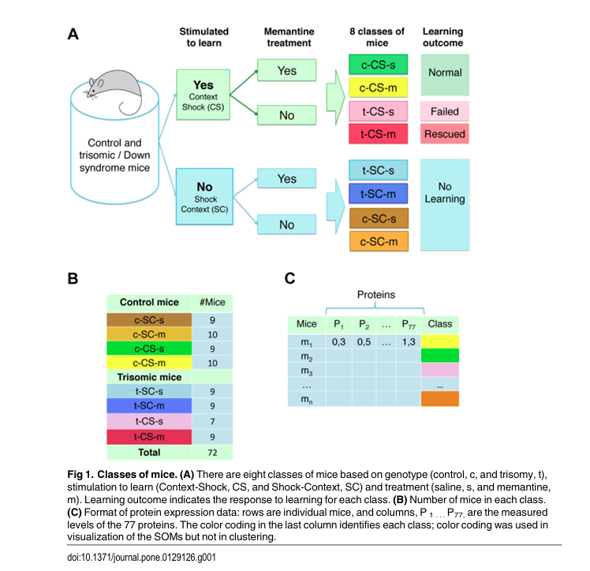
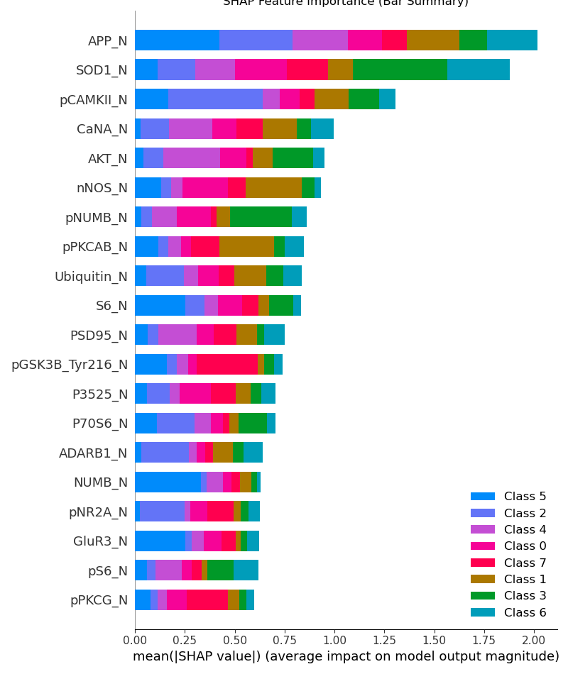
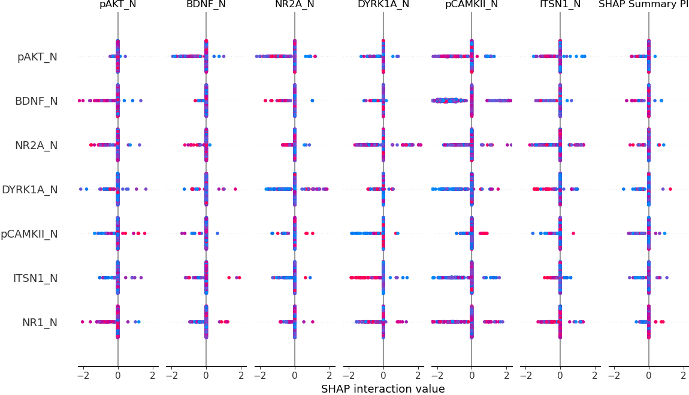

#  Mice Protein Expression — Classifying Genotype, Treatment & Behavior

> Machine learning pipeline to recognize Down’s Syndrome and treatment effects in mice based on protein expression data.  
> Combines machine learning, hyperparameter optimization, and biological interpretability (SHAP, PCA/UMAP, t-SNE, PDP).

---

##  Project Overview

This project analyzes **mice protein expression** data to classify subjects by their:
- **Genotype** (Control or Down’s Syndrome, Ts65Dn)
- **Treatment** (Memantine or saline)
- **Behavioral conditioning** (Context-shock or Shock-context)

Dataset source: [UCI ML Repository – *Mice Protein Expression Dataset*](https://archive.ics.uci.edu/ml/datasets/Mice+Protein+Expression)  
Original study: *Higuera et al., PLOS ONE (2015)*

The goal is to build an **explainable ML model** that reveals how molecular-level protein differences encode genotype and treatment outcomes.

---

##  Dataset Summary

| Attribute | Description |
|------------|-------------|
| Samples | 1080 mouse brain samples |
| Features | 77 protein expression levels (normalized) |
| Targets | 8 combined conditions (genotype × treatment × behavior) |



---

##  Pipeline Overview

1. **Preprocessing**
   - Handle missing values, scale features with `StandardScaler`
   - Encode target classes using `LabelEncoder`
   - Dimensionality reduction with **PCA (95% variance)** for modeling and **t-SNE/UMAP** for visualization

2. **Model Training & Optimization**
   - Models: **SVM (RBF)**, **LightGBM**, **Logistic Regression**
   - Optimized via **Optuna**
   - Evaluated with **StratifiedGroupKFold CV**

3. **Evaluation & Interpretation**
   - Confusion matrix, weighted F1, macro F1
   - Global & local SHAP explanations
   - PCA, t-SNE, and PDPs for feature behavior
   - Comparative protein-level analysis (control vs Ts65Dn, learning vs non-learning)

---

##  Model Performance

| Model | Weighted F1 | Macro F1 | Accuracy | Notes |
|--------|--------------|-----------|-----------|-------|
| **SVM (RBF)** | **0.68** | 0.61 | ~0.67 | Best generalization and interpretability |
| **LightGBM** | 0.66 | 0.59 | ~0.64 | Robust tree-based model |
| **Logistic Regression** | 0.60 | 0.55 | ~0.58 | Linear baseline |


---

##  Model Interpretation & Biological Insights

This section summarizes findings from SHAP, t-SNE, and protein-level analyses.

---

###  Top Influential Proteins (SHAP Analysis)

| Protein | Role | Interpretation |
|----------|------|----------------|
| **APP_N** | Amyloid precursor protein | Overexpressed in Ts65Dn due to gene triplication; signals altered neurodevelopment. |
| **SOD1_N** | Oxidative stress defense | Elevated in Ts65Dn; reflects chronic oxidative stress. |
| **pCAMKII_N** | Synaptic plasticity | Decreased in Ts65Dn; Memantine restores partially. |
| **nNOS_N** | Neurotransmission | Reduced nitric oxide signaling; impaired excitability. |
| **CaNA_N** | Calcium signaling | Reduced in Ts65Dn, improves with learning and treatment. |

> SHAP confirms that **oxidative stress (SOD1)** and **synaptic signaling (pCAMKII, CaNA)** dominate the molecular distinction between healthy and Down’s mice.





---

###  t-SNE Visualization — Class Separability

- t-SNE shows **two main superclusters** corresponding to Control and Ts65Dn genotypes.  
- Within each genotype, **Memantine-treated** and **saline** subgroups cluster separately but overlap, reflecting subtle treatment effects.
! [Placeholder: insert t-SNE plot here] (results/t-SNE.png)

> **Interpretation:**  
> Genotype defines the major protein-expression manifold, while treatment shifts the Ts65Dn distribution toward control-like regions — indicating **partial molecular normalization**.


---

###  Protein-Level Comparison (Control vs Ts65Dn)


Control vs Ts65Dn (untreated) under identical conditions shows:
- **Down-regulation:** pCAMKII, CaNA, nNOS → weaker plasticity & calcium signaling  
- **Up-regulation:** SOD1, APP → oxidative stress and amyloid elevation  

> These changes are consistent with the Down’s molecular phenotype — reduced synaptic strength, increased oxidative load.


---

### Behavior-Linked Protein Dynamics (Learning in Control Mice)


Learning behavior triggers:
- ↓ **SOD1, AKT, pCAMKII** → reduced oxidative/metabolic signaling  
- ↑ **CaNA, APP** → homeostatic calcium regulation and synaptic remodeling  

> Healthy mice show **adaptive downregulation of stress proteins** and **upregulation of synaptic regulators**, representing an efficient learning signature.


---

###  Memantine-Induced Molecular Restoration (Ts65Dn)

After Memantine + learning stimulation:
- **↑ CaNA, pCAMKII, SOD1** → restored calcium and synaptic balance  
- **↓ AKT, APP** → normalized metabolism and amyloid expression  

> Memantine induces a **partial rescue of Down’s molecular deficits**, promoting a shift toward control-like plasticity dynamics.


---

###  Oxidative Stress Dynamics (SOD1 Distributions)


- In control mice, **SOD1 decreases sharply during learning**, indicating lowered oxidative stress.  
- In Ts65Dn mice, **SOD1 remains high**, even with learning — showing persistent redox imbalance.  

> Memantine slightly normalizes this pattern but does not fully restore oxidative adaptability.


---

##  Final Summary

> **Normal learning:** Downregulation of stress pathways + enhancement of calcium signaling  
> **Down’s phenotype:** Elevated oxidative and amyloid proteins + suppressed plasticity  
> **Memantine effect:** Partial normalization — increases in CaNA and pCAMKII, decreases in APP and AKT  

Together, these results show that **protein-level restoration mirrors behavioral recovery**, confirming the biological validity of the ML findings.

---

## Interpretability Tools

| Tool | Purpose |
|------|----------|
| **SHAP (KernelExplainer)** | Quantifies per-protein contribution to predictions |
| **t-SNE / UMAP** | Visualizes separability and treatment shifts |
| **PartialDependenceDisplay** | Highlights nonlinear effects per class |
| **Confusion Matrix** | Evaluates model accuracy by condition |


---

##  Usage

```
# install dependencies
pip install -r requirements.txt

# train models
python src/train-model.py

# run interpretation notebook
jupyter notebook src/interpretation.ipynb
```

## References

Higuera, C., Gardiner, K. J., & Cios, K. J. (2015).
Self-Organizing Feature Maps Identify Proteins Critical to Learning in a Mouse Model of Down Syndrome.
PLOS ONE, 10(6): e0129125

Dataset: UCI Mice Protein Expression

#### Tech Stack

Python 3.10 • scikit-learn • Optuna • LightGBM • SHAP • Matplotlib • Seaborn • Pandas • NumPy

#### Author:
Aparna Praturi, Ph.D.
Physicist → Data Scientist
Exploring biological insight through interpretable AI
